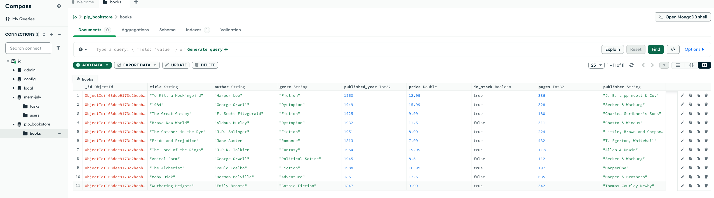

# PLP Bookstore MongoDB Assignment

## 🗄️ Overview
This repository contains MongoDB scripts for the Week 1 assignment: **Data Layer Fundamentals and Advanced Techniques**.  
It demonstrates how to perform CRUD operations, advanced queries, aggregation pipelines, and indexing using MongoDB.

---

## 📂 Project Structure

```
project-folder/
├── insert_books.js      # Modified script to insert sample book data
├── queries.js           # All MongoDB queries (CRUD, advanced, aggregation, indexing)
├── .env                 # MongoDB connection info
├── README.md            # This file
├── screenshot.png       # Screenshot of MongoDB Compass
├── package.json
```

---

## ⚙️ Setup Instructions

1. **Install MongoDB**  
   - Option A: Install [MongoDB Community Edition](https://www.mongodb.com/try/download/community) locally.  
   - Option B: Create a free [MongoDB Atlas](https://www.mongodb.com/cloud/atlas) cluster.

2. **Clone this repository**
```bash
git clone <your-repo-url>
cd <repo-folder>
```

3. **Install Node.js dependencies**
```bash
npm install mongodb dotenv
```

4. **Configure environment variables**
Create a `.env` file in the project root with:

```env
MONGO_URI=mongodb://localhost:27017      # Or your Atlas URI
DB_NAME=plp_bookstore
```

5. **Insert sample book data**
```bash
node insert_books.js
```
This script will populate the `books` collection with at least 10 documents.

---

## 📖 How to Run Queries

All queries are in `queries.js`. It uses **a single connection** and is fully commented.  

1. Open `queries.js` in your code editor.  
2. Modify or uncomment the queries you want to run.  
3. Run the script:
```bash
node queries.js
```
4. View results in the terminal.  

**Queries included:**

- **Task 2: CRUD**
  - Find books by genre
  - Find books by author
  - Find books published after a certain year
  - Update price of a book
  - Delete a book

- **Task 3: Advanced Queries**
  - In-stock books published after 2010
  - Projection (title, author, price)
  - Sorting by price (ascending/descending)
  - Pagination (5 books per page)

- **Task 4: Aggregation Pipelines**
  - Average price by genre
  - Author with most books
  - Group books by decade

- **Task 5: Indexing**
  - Create index on `title`
  - Create compound index on `author` and `published_year`
  - Explain query performance using `explain()`

---

## 📷 Screenshot



---

